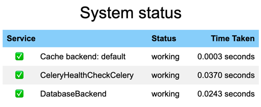

# Season Tickets Tech Backend

### Description:

Current repository is a backend part of comprehensive STT project, which is a working name for [Seat Split](https://www.seatsplit.com/) consignment portal. Seat Split allows ticket season holders to sell their tickets to other fans. Currently, we support only sports events, but in the future we are planning to expand our business to other events like concerts, theaters, etc.

### Main stack:
- Python
- Django
- Django Rest Framework
- PostgreSQL
- Redis
- Celery
- Docker
- Poetry

### Installation:

1. Clone the repository from GitHub.
2. Create `.env.dev` in django-backend directory using `.env.dev.example`.
3. Install Docker and launch the daemon.
4. Cd to project's root and run `docker compose up --build`.

### Project structure:
#### Directories:

- **django-backend** - contains all necessary files for Django backend.
  - **apps** - contains all existing django applications and common (among them) files.
  - **config** - contains standard Django settings files.
  - **templates** - contains Django admin template settings as well as email templates.
- **nginx** - contains all necessary files for nginx configuration (in case we are the one who manage nginx).
- **shell_scripts** - contains all shell commands that can make our life much easier.
   - **create_requirements.sh** - creates `dev-requirements.txt` and `prod-requirements.txt` files.
   - **docker_deploy.sh** - builds docker container and pushes it to Heroku.
   - **run_tests.sh** - runs all tests and creates html report.
   - **make_project_structure_tree.sh** - creates project structure.
   - **heroku_backup.sh** - contains all necessary commands to backup Heroku database.
   - **count_lines_of_code.sh** - counts all lines of code in the project.


#### Separated files:

- **.dockerignore** - list of files or directories that are excluded from getting into docker container.
- **.flake8** - custom settings for flake8 linter.
- **.gitignore** - list of files or directories that are excluded from getting into git repository.
- **.pre-commit-config.yaml** - custom settings for flake8, black and isort linters hooks.
- **docker-compose.yml** - file-constructor, that allows to build docker containers. Used for local development only.
- **Dockerfile** - file-instruction of how to build docker image for services like Heroku and Railway.
- **Dockerfile-dev** - file-instruction of how to build docker image for local development. This is the file, that `docker-compose.yml` is using for building docker container to run it locally.
- **Dockerfile-prod** - file-instruction of how to build docker image for production deployment in case we use VPS.
- **pyproject.toml** - custom project's settings. This file contains all necessary information about the project itself, dev and prod dependencies. Used to create `dev-requirements.txt` and `prod-requirements.txt` files.

### Important environment variables:

First of all, check out `.env.dev.example` file. It contains all necessary environment variables that are used in the project.
Here is the detailed explanation of some of them (the rest are self-explanatory):
- `ROLLBAR_ACCESS_TOKEN` - token for [Rollbar](https://rollbar.com/) service, which is used for error tracking.
- `CELERY_AGGREGATED_SLACK_NOTIFICATION_COUNTDOWN` - countdown for Celery task, which aggregates all ticket created notifications and sends them to Slack.
- `STT_NOTIFICATIONS_BOT_API_TOKEN` - token for [Slack](https://slack.com/) bot, which is used for sending notifications to Slack.
- `STT_NOTIFICATIONS_CHANNEL_ID` and `STT_WEEKLY_ISSUES_REPORT_CHANNEL_ID` - ids of Slack channels, where notifications and weekly reports are sent. For test purposes we are using `#test-channel` channel with id `C06BH3YAPV4`.
- `HEALTH_CHECK_TOKEN` - token for health check endpoint. Used for monitoring purposes. Basically you are the one who generates it and inputs as an environment variable. Then you use it while sending requests to health check endpoint.
- `BUSINESS_TOTAL_EXPENSES` - percentage of total expenses that are used for business purposes. For example, if we list clint's ticket for $100 and our percentage is 20% (insert as 0.2), then client will get $80 and we will get $20.
- `GENERATE_EMAILS_TOKEN` - token for `/generate_random_data_with_provided_domain_or_state/` endpoint. Used for generating random emails with provided domain or state.
- `GITHUB_ACCESS_TOKEN` - token for Weekly Issues Report. Used for getting all issues from Github and sending them to Slack.

### Health check endpoint:

We have a health check endpoint, which is used for monitoring purposes. It is located at `api//health-check/` and requires `HEALTH_CHECK_TOKEN` environment variable to be set. This is based on `django-health-check`package, so all information about it can be found [here](https://github.com/revsys/django-health-check). In order to call this endpoint, you need to provide `Authorization` header with a value, which is equal to `HEALTH_CHECK_TOKEN` environment variable:
```
"Authorization": "HEALTH_CHECK_TOKEN"
```
Example of the successful response:


Currently it checks the following services:
- Database (PostgreSQL)
- Cache (Redis)
- Celery


### Deployment to Heroku

#### Using Container Registry:

1. Prepare correct Dockerfile
2. Use this command to build the container:\
`docker build -t registry.heroku.com/<app_name>/web .`
3. Push the container to registry.heroku.com:\
`docker push registry.heroku.com/<app_name>/web`
4. Release the container to production:\
`heroku container:release -a <app_name> web`

Also, you can simply run `docker_deploy.sh`and script will complete these 3 commands for you.

### Deployment to Railway
#### Using Github Actions:

Railway will automatically deploy the app in case **main** branch has been updated.

### Git workflow:

We are using simple Git workflow with **main** and **develop** branches. All new features should be developed in separate branches (`feature/<relevant_feature_name>`) and then merged into **develop** branch after **Pull Request** is reviewed and approved.
The next step would be creating a **Pull Request** from **develop** to **main** branch and merge it.

### PR template:
1. What does this PR do?
2. Why are we doing this?
3. How should this be manually tested?
4. Any background context you want to provide?
5. What are the relevant tickets?
6. Screenshots (if appropriate).
7. Questions.

### Getting events data:

A full instruction on how to get required data using SkyBox personal account and Postman can be found [here](docs/get_events_data.md).

#### Useful notes:
1. Heroku `python manage.py collectstatic` issue solution can be found [here](https://stackoverflow.com/questions/55330749/error-while-running-python-manage-py-collectstatic-noinput-after-changin).
2. Django-tabulator-example is [here](https://github.com/cuauhtemoc-amdg/django-tabulator-example).
3. Responsive tables using Django and htmx. The main article is [here](https://enzircle.com/responsive-table-with-django-and-htmx#comments-list). Github [source code](https://github.com/joashxu/dj-htmx-fun).
4. Django-tables2 [documentation](https://django-tables2.readthedocs.io/en/latest/index.html).
5. Django-filter [documentation](https://django-filter.readthedocs.io/en/stable/index.html).
6. Django-crispy-forms [documentation](https://django-crispy-forms.readthedocs.io/en/latest/index.html).
7. Django Model meta [options](https://docs.djangoproject.com/en/4.1/ref/models/options/).
8. Detailed Django Form [explanation](https://simpleisbetterthancomplex.com/article/2017/08/19/how-to-render-django-form-manually.html).
9. Django Widget Tweaks is [here](https://simpleisbetterthancomplex.com/2015/12/04/package-of-the-week-django-widget-tweaks.html).
10. Django permissions [detailed article](https://dandavies99.github.io/posts/2021/11/django-permissions/).
11. If you ever you deleted [Django migrations](https://stackoverflow.com/questions/37603203/django-deleted-migrations-directory)
12. Git Cheat [Sheet](http://res.cloudinary.com/hy4kyit2a/image/upload/SF_git_cheatsheet.pdf)
13. JWT [decoding](https://jwt.io/)
14. Using [dictionary](https://stackoverflow.com/questions/72623440/django-name-filter-name-icontains-is-not-defined) as filter value
15. Super useful approaches of how to get user and group permissions is [here](https://stackoverflow.com/questions/16573174/how-to-get-user-permissions)


#### Useful commands:
1. Access project's bash:\
`heroku run bash -a <heroku app name>`
2. Check all releases:\
`heroku releases`
3. Check all info about particular release:\
`heroku releases:info <release version number>`
4. If ever we deployed buggy code or something goes wrong with current release:\
`git revert`and redeploy it again.
5. If we have some problems with heroku platform, then better to use:\
`heroku rollback <release version number (optional)>`
6. Heroku app logs:\
`heroku logs -n 1500`or `heroku logs -t`to maintain them live
7. Safely delete all rows from database:\
`python manage.py truncate --apps <app_name> --models <model_name>`
8. Reset PK in postgresql DB (apply only after deleting all info from the table):\
`python manage.py sqlsequencereset <app_name> | python manage.py dbshell`
9. Safely delete an app:\
`python manage.py migrate <app_name> zero`\
After running this command we can delete an app from INSTALLED_APPS and delete a corresponding directory
10. Check project's files with flake8 and black before making commit:\
`pre-commit run --all-files`
