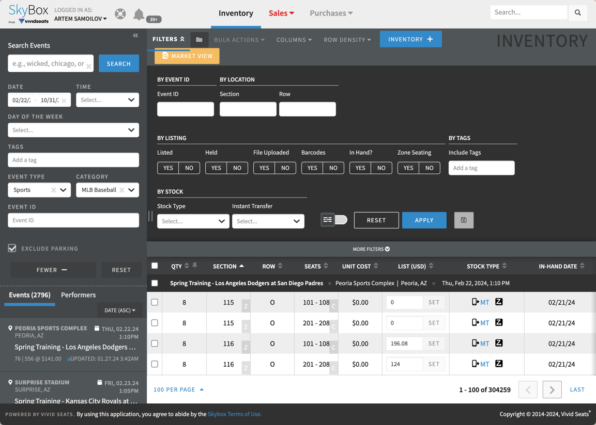
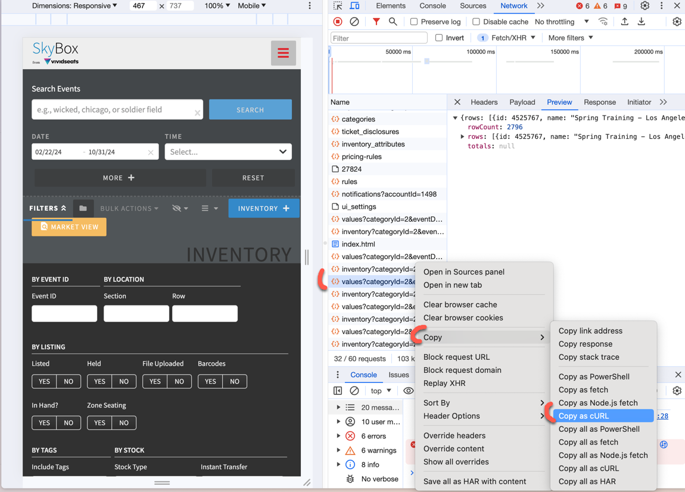
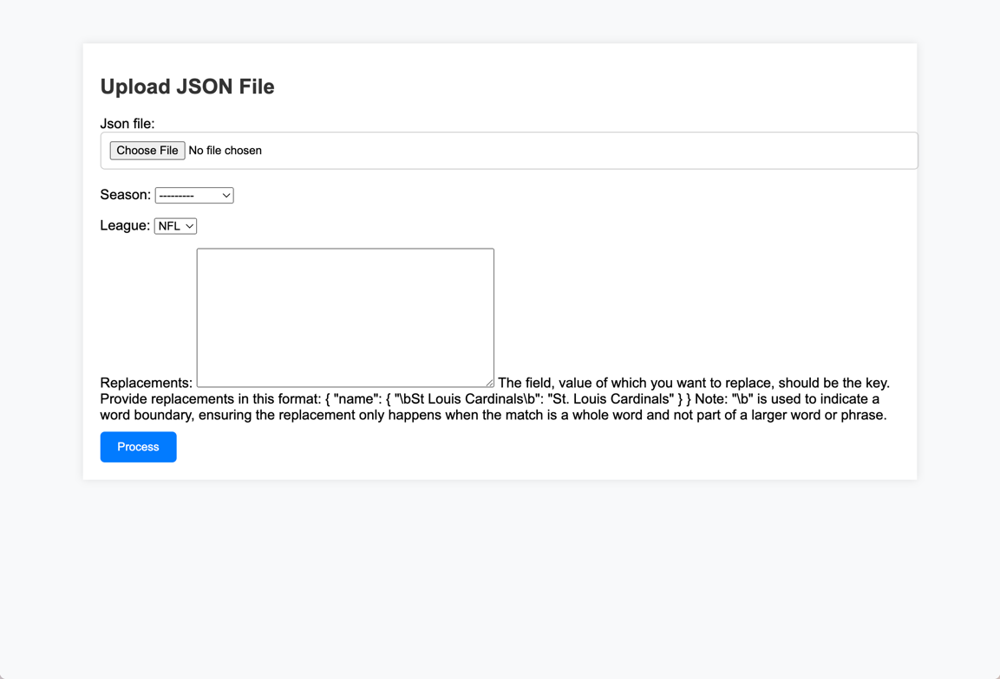
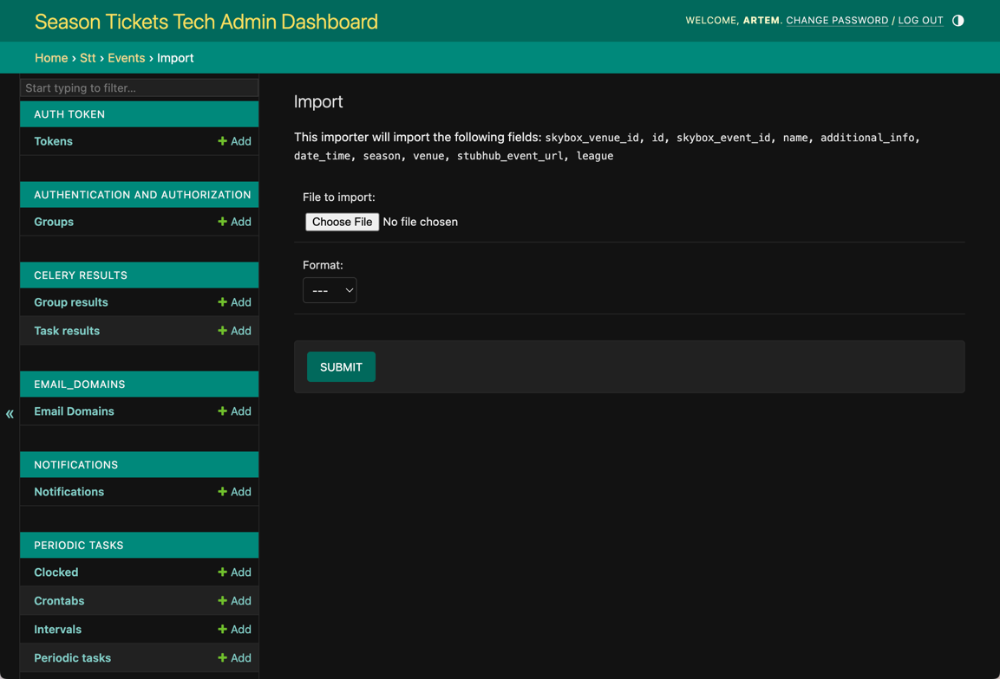

# Seat Split Events

For operating, we need to always have updated data for the following major leagues:

- MLB
- MLS
- NBA
- NFL
- NHL

The easiest way to get such data would be to use SkyBox API, however at the time of writing this (29.01.2024), SkyBox API is not really available for us due to problems with its credentials.

Another solution would be to use regular SkyBox account (for example - personal one).

Here is full instruction on how to get required data using SkyBox, personal account and Postman.
All further instructions will be for MLB, but the same steps can be applied to other leagues.

- Log in to your SkyBox account.
- Enter the season date range (for example, 2024-02-22 - 2024-10-31) in `Date` field.
- Press `more +` button on the sidebar, select `Sports` as event type and `MLB Baseball` as category.
- Check `Exclude parking` checkbox.
- Press `Search` button.

Should look similar to this:



Now we need to make some manipulation in developer tools to get the data we need.

- Open developer tools in your browser.
- Go to `Network` tab.
- Press `Search` button on the page again.
- Look for a request name that starts from `values?categoryId...` and click on it.
- In `Response` tab you will see the data we need. Just double check that it is the data we need.
- If all is good, click on `Copy as cURL` button like on the picture below:



- Open Postman and import the request you just copied.
- You can try to send a request and see if it works. It should.
- Change `limit` in params to `3000`or any other big number in order to fetch all events at once.
- You can even use this test JavaScript code to count all items in the response:

```javascript
var jsonData = pm.response.json();

pm.test("Count number of objects in rows", function () {
    pm.expect(jsonData.rows.length).to.be.a('number');
    console.log("Number of objects in rows: " + jsonData.rows.length);
});
```
- Save response as a JSON file.

After that you can go to the main page of backend url (for example: 127.0.0.1:8000/ for local machine), upload the file you just saved and fill out the form.

Here is how it should look like:



Season dropdown is connected to the database, so you can select the season you need. UUID of the season will be past to the output csv file.

When it comes to replacements, take note of this format:
```json
{
        "name": {
                "\\bSt Louis Cardinals\\b": "St. Louis Cardinals"
        }
}
```
Note: `"\\b"` is used to indicate a word boundary, ensuring the replacement only happens when the match is a whole word and not part of a larger word or phrase.

Once you `process`, you will get a processed csv file with all the events prepared to be imported to the database. This can be done via admin dashboard.



There might be some small errors after scanning all the events mostly related to different team names. You can fix them manually in the csv file and re-upload it to the database.
