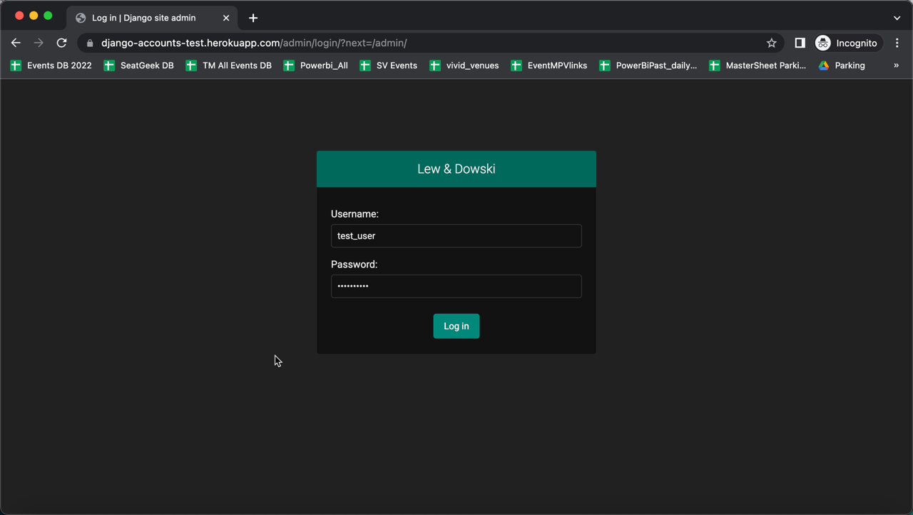
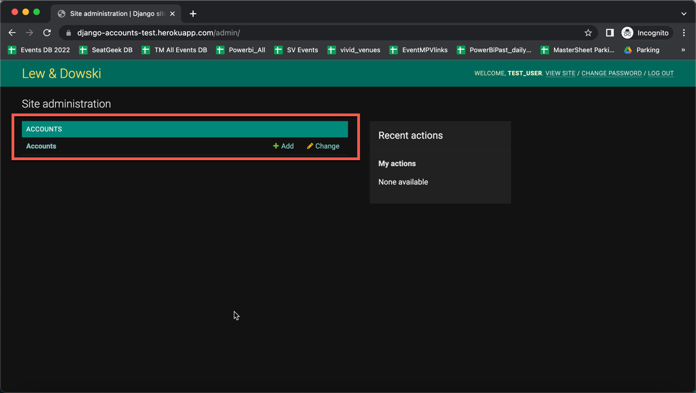
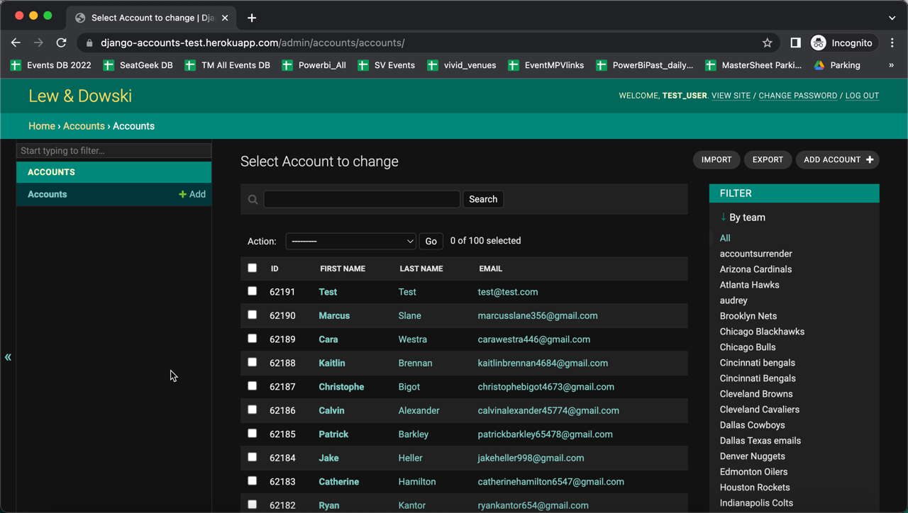
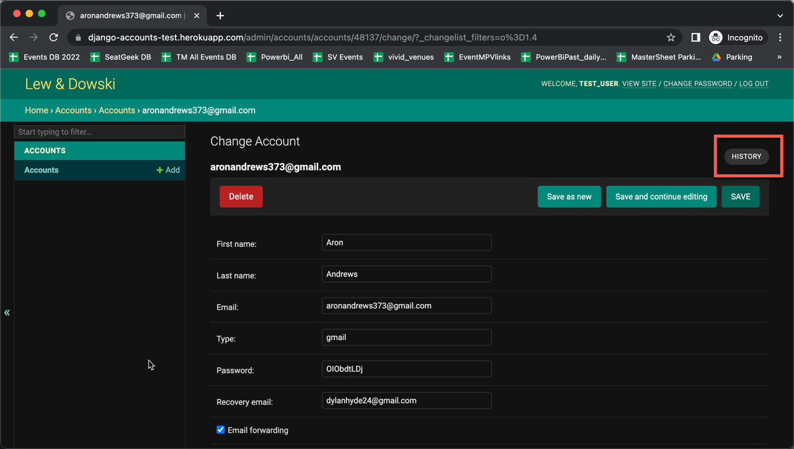
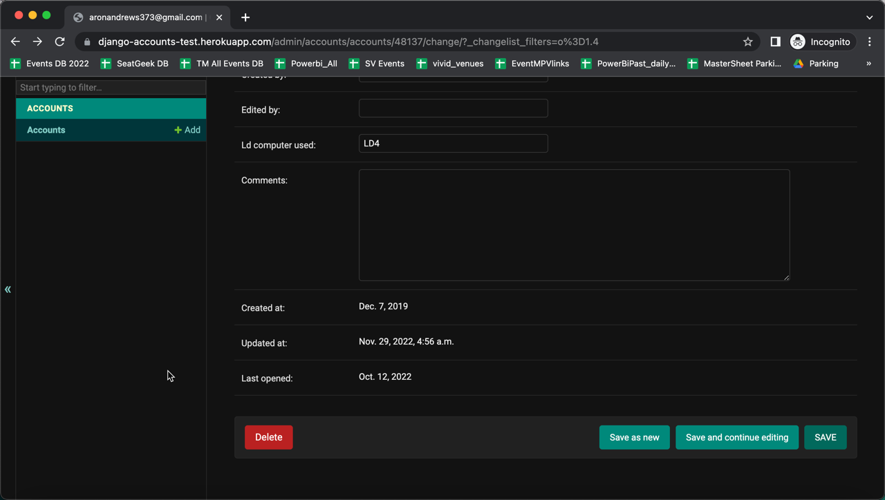
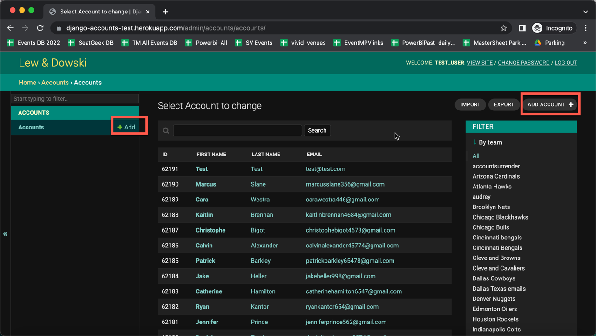
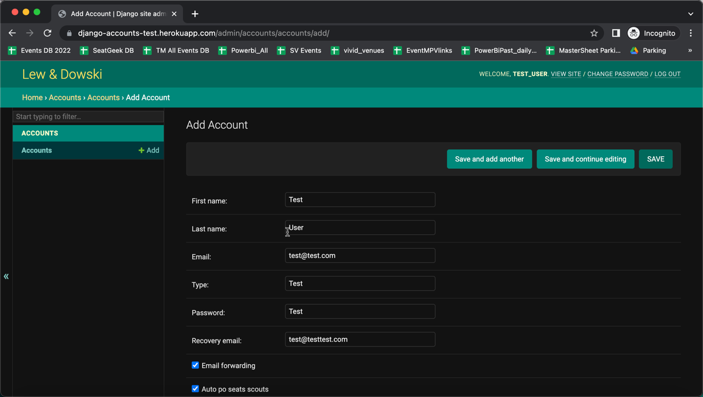

# Django admin dashboard instruction

This is an instruction of how to use django admin dashboard for TLs and general users. Please take note that admin dashboard's UI will be used only as a temporary solution, while we are still designing a new web app, but all main functionality is available, and you will be able to do all same things that you have been doing before in Goggle Sheets. For any questions or requests, please contact me (@samoylovartem) in Slack.

### Login page

Every user will receive login and password, that can be used to log in to the admin dashboard. You can log in [here](https://django-accounts-test.herokuapp.com/admin/). 

### Main page

Once login is successful you will be able to see departments that you have access to, like on the screenshot above. Just click on department's name to go through. 

### Department's main page

In the middle of the page you will see list of accounts available under Accounts' department and the search field above.

On the right side you can select multiple filters in order to narrow down the list. All filters are customizable, so if ever you want a filter to be added or deleted, you might want to contact me in Slack. Displayed fields in the middle part of the page (ID, first name, last name) are also customizable. I can add more fields or remove some of them. You know the drill. 

P.S. You can even use those displayed fields for ordering. Press on a field (ID for example) and you will see that all accounts are ordered in ascending way. By default, all accounts are ordered by "-created_at" field, which means that new accounts will be on top.

### Inside an existing account

If you click on an account, you will be able to see all available fields (same as it was in Google sheets) and work with them as you need. If you changed something there, just press save button (available on both top and bottom sides). In "history" you will see all changes of chosen account with date-time indication as well as with author of changes. If you have rights to delete an account, you will have a corresponding button as well.

### Create a new account

New account can be created by clicking on one of the corresponding buttons like on the screenshot above. You will see exact same interface as if you would open an existing account except the fact that all data fields are empty:

Just fill out the data fields and press save. 

### Conclusion
Basically, that's all the information you need to know in order to use admin dashboard. The UI is pretty intuitive, but any questions are welcome. 
Please take note that some data fields might have data validation enabled. It will help to reduce amount of possible mistakes and will maintain the information inside database clean and formatted the way it should be. 
Any feedback is also very important and welcomed!

I hope you will have a nice experience using this admin dashboard. 
Thanks! :)

